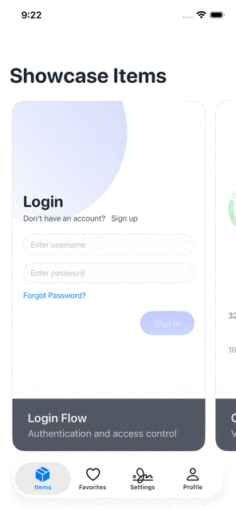

# GentleDesignShowcase

A showcase app demonstrating the **GentleDesignSystem** applied to common screens and flows. Browse through curated UI templates and see how the design system brings consistency and polish to typical iOS app patterns.

## Purpose

GentleDesignShowcase serves as a living preview of the GentleDesignSystem in action. It provides a collection of common screen templates—sign-in flows, onboarding pagers, profile headers, storefronts, charts, and more—all styled with the design system's tokens and components.

## Current Features

- **Screen Previews**: Browse a curated collection of common iOS UI patterns and templates
- **Pre-rendered Caching**: Each screen is pre-rendered ahead of time and cached, enabling smooth scrolling through the showcase gallery
- **Design System Integration**: All templates use GentleDesignSystem components and styling

## Roadmap

In future releases, GentleDesignShowcase will support:

- **Design Token Customization**: Adjust typography, spacing, and other design tokens in real-time
- **Color Theme Editing**: Experiment with different color palettes and see changes reflected instantly
- **Surface Customization**: Modify surface treatments and elevation styles for quick prototyping

Currently, the app displays templates using its default design system settings.

## Demo

## Requirements

- iOS 17.0+
- Xcode 15.0+
- Swift 5.9+

## License

This project is licensed under the MIT License - see the [LICENSE](LICENSE) file for details.
