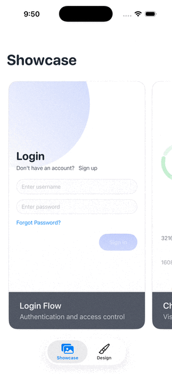

# GentleDesignShowcase

[](https://github.com/gentle-giraffe-apps/GentleDesignShowcase/actions/workflows/ci.yml)
[](https://developer.apple.com/ios/)
[](https://swift.org/)
[](https://developer.apple.com/xcode/swiftui/)
[](LICENSE)

A showcase app demonstrating the **GentleDesignSystem** applied to common screens and flows. Browse through curated UI templates and see how the design system brings consistency and polish to typical iOS app patterns.

## Demo



## Purpose

GentleDesignShowcase serves as a living preview of the GentleDesignSystem in action. It provides a collection of common screen templates—sign-in flows, onboarding pagers, profile headers, storefronts, charts, and more—all styled with the design system's tokens and components.

## Features

### Showcase Gallery
- **Screen Previews**: Browse a curated collection of common iOS UI patterns and templates
- **Pre-rendered Caching**: Each screen is pre-rendered ahead of time and cached, enabling smooth scrolling through the showcase gallery
- **View-Aligned Scrolling**: Horizontal gallery with snap-to-card scrolling for a polished browsing experience
- **Design System Integration**: All templates use GentleDesignSystem components and styling

### Design Editor
- **Live Design Editing**: Open the Design tab to customize design tokens including colors, typography, spacing, and surface treatments
- **Persistent Changes**: Your design customizations are automatically saved and persist across app launches
- **Instant Preview Refresh**: Switch back to the Showcase tab to see your design changes applied to all templates - the gallery automatically re-renders with your updated design

### Workflow
1. Browse the **Showcase** tab to see templates styled with the current design
2. Switch to the **Design** tab to customize colors, typography, and other tokens
3. Return to the **Showcase** tab - all previews automatically refresh to reflect your changes
4. Iterate on your design until you achieve the look you want

### Included Templates
- **Sign-In Flow**: Login form with email/password fields and validation
- **Charts & Stats**: Data visualization with metrics and charts
- **Storefront Grid**: Product grid layout for e-commerce
- **Onboarding Pager**: Paginated onboarding experience
- **Medical Intake Form**: Complex multi-section form
- **Profile Header**: User profile with avatar and action buttons

## Requirements

- iOS 26.0+
- Xcode 26.0+
- Swift 6.0+

## Getting Started

```bash
# Install mise (if not already installed)
curl https://mise.run | sh

# Navigate to the project directory
cd GentleDesignShowcase

# Install Tuist (mise will use the version from mise.toml)
mise install

# Generate the Xcode project
tuist generate
```

## License

This project is licensed under the MIT License - see the [LICENSE](LICENSE) file for details.
